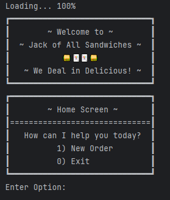
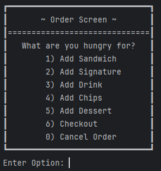
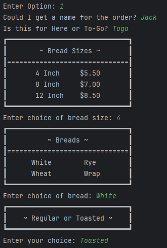
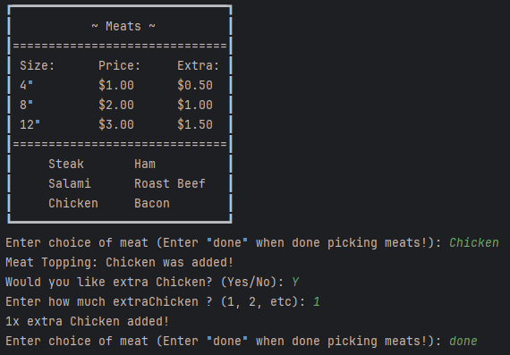
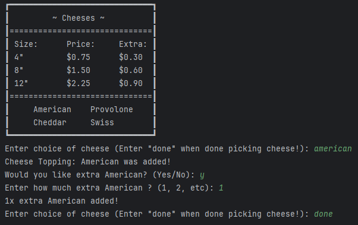
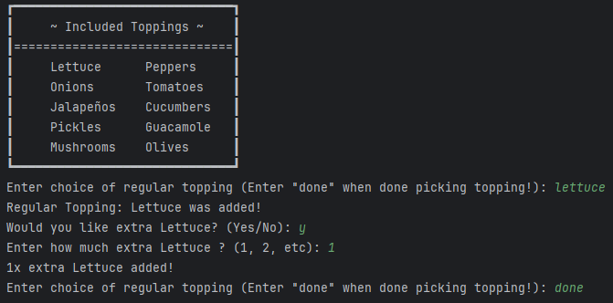
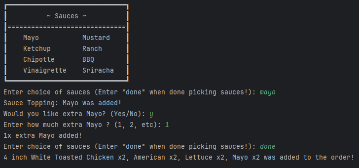
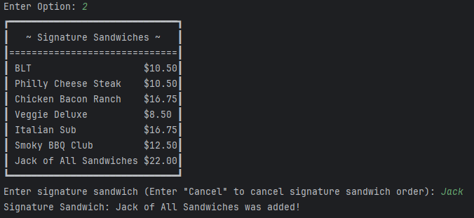
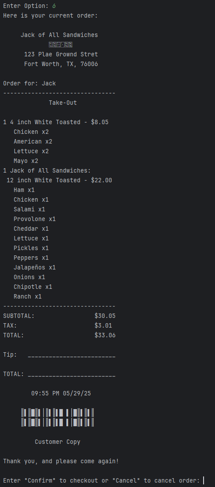

# 🥪 Jack of All Sandwiches
> _“We Deal in Delicious.”_  
A customizable sandwich shop terminal app built in Java, with support for signature sandwiches, receipt generation, and a fully interactive CLI menu system.

---

## 📦 Overview

**Jack of All Sandwiches** is a Java console application that allows users to:
- Build custom sandwiches with meats, cheeses, toppings, sauces
- Choose from prebuilt signature sandwiches
- Add sides like drinks, chips, and desserts
- View a running receipt and save the order to a file
- Fully navigate the ordering experience via CLI

---

## ✨ Core Features

- 🔧 **Custom Sandwich Builder**: Select bread type, size, toasted preference, and all toppings
- 🃏 **Signature Sandwiches**: Choose pre-configured recipes like BLT or Philly Cheesesteak
- 🥤 **Add Sides**: Drinks, chips, and desserts
- 🧾 **Dynamic Receipt**: Itemized output with tax and timestamp, saved to file
- 🔁 **Multiple Sandwiches per Order**: Loop-based flow lets users add 1+ sandwiches
- 💾 **Order Saving**: Receipts saved as `.txt` files with unique timestamps
- ✅ **JUnit 5 Tests**: Unit tests for core logic like pricing, toppings, and orders

---

## 🧠 OOP Design & Principles

### ✅ Single Responsibility Principle (SRP)
Each class handles one clear role (e.g., `Sandwich`, `Order`, `UserInterface`, `FileManager`).

### 🧱 Abstract Classes
- `Topping` is an abstract class, extended by:
    - `RegularTopping`
    - `PremiumTopping`, which is extended by `Meat` and `Cheese`

### 🧩 Interface
- `Priceable`: implemented by `Sandwich`, `Sides`, `Drink`, `Dessert` to support polymorphic pricing.

### 🧾 ReceiptFileManager
- Writes a `.txt` receipt to a `/resources/receipts/` directory using a timestamp-based filename.

---

## 🧪 Unit Testing (JUnit 5)

Test coverage includes:
- 🧮 Topping pricing logic
- 🥪 Sandwich topping counts and price
- 🧾 Order total calculations
- 📄 File output (manually tested)

## 📁 Project Structure
```bash
com.pluralsight
├── datamodels
│   ├── Sandwich.java
│   ├── Order.java
│   ├── Topping.java (abstract)
│   ├── PremiumTopping.java (abstract)
│   ├── Meat.java, Cheese.java
│   ├── RegularTopping.java
│   ├── Drink.java, Chips.java, Dessert.java
│   └──SignatureSandwich.java
├── interfaces
│   └── Priceable.java
├── utility
│   └── ReceiptFileManager.java
├── ui
│   └── UserInterface.java
└── SandwichApp.java
```

## 📊 Project Diagram


## 📸 Screenshots

### Home Screen


### Order Screen


### Sandwich Prompts


### Meat Toppings


### Cheese Toppings


### Regular Toppings


### Sauces


### Signature Sandwiches


### Receipt


## 💭 Interesting Piece of Code
```java
public String getOrder() {

        // creates string builder
        StringBuilder receiptBuilder = new StringBuilder();

        // sandwich shop name and address
        receiptBuilder.append("     Jack of All Sandwiches\n");
        receiptBuilder.append("             \uD83C\uDCDC\uD83C\uDCDA\uD83C\uDCD6\uD83C\uDCC1\uD83C\uDCAD\uD83C\uDCBA\n");
        receiptBuilder.append("      123 Plae Grownd Stret\n");
        receiptBuilder.append("      Fort Worth, TX, 76006\n");

        // receipt header with customer name and displays either eat in or take out
        receiptBuilder.append("\nOrder for: ").append(this.orderName).append("\n");
        receiptBuilder.append("--------------------------------\n");
        String eatInOrTakeOut = isTakeOut ? "Take-Out" : "Eat-In";
        receiptBuilder.append("             ").append(eatInOrTakeOut).append("\n\n");

        // displays each sandwich's details and its toppings
        for (Sandwich sandwich : sandwiches) {
            receiptBuilder.append("1 ").append(sandwich.getSandwich())
                    .append(" - $").append(String.format("%.2f", sandwich.getPrice())).append("\n");

            for (Topping topping : sandwich.getToppings()) {
                receiptBuilder.append("   ").append(topping).append("\n");
            }
        }
        // displays each side
        for (Priceable side : sides) {
            receiptBuilder.append("1 ").append(side.toString())
                    .append(" - $").append(String.format("%.2f", side.getPrice())).append("\n");
        }
        // displays subtotal, tax, and total
        double tax = getTotal() * 0.10;
        double total = getTotal() + tax;
        receiptBuilder.append("--------------------------------\n");
        receiptBuilder.append("SUBTOTAL:                 $").append(String.format("%.2f", getTotal())).append("\n");
        receiptBuilder.append("TAX:                      $").append(String.format("%.2f", tax)).append("\n");
        receiptBuilder.append("TOTAL:                    $").append(String.format("%.2f", total)).append("\n");;
        // displays tip and total
        receiptBuilder.append("\nTip:   _________________________\n");
        receiptBuilder.append("\nTOTAL: _________________________\n");

        // gets the current time and date
        DateTimeFormatter formatter = DateTimeFormatter.ofPattern("hh:mm a MM/dd/yy");
        receiptBuilder.append("\n        ").append(LocalDateTime.now().format(formatter)).append("              \n\n");
        receiptBuilder.append("     ║▌║█║▌│║▌║▌█ ▌│█║▌║▌║\n");
        receiptBuilder.append("     ║▌║█║▌│║▌║▌█ ▌│█║▌║▌║\n");
        receiptBuilder.append("\n         Customer Copy\n");
        receiptBuilder.append("\nThank you, and please come again!");

        // puts receipt together into a string
        return receiptBuilder.toString();
    }
```
One of the most interesting and important part of my project is the getOrder() method in the Order class, which dynamically generates the customer's full receipt. This method uses a StringBuilder to format the entire order summary—including sandwiches, toppings, sides, subtotal, tax, and timestamp—into a realistic and polished receipt layout.

What makes it stand out is the attention to both functionality and presentation: the method includes custom formatting, emojis, spacing, and alignment to give the output a fun, branded feel for Jack of All Sandwiches. It’s not just a plain text dump—it’s a complete user-facing experience. This method is also critical for writing receipts to files, meaning it directly ties into the file-saving feature that finalizes the ordering process.

By keeping this logic encapsulated within the Order class, it follows single responsibility principles and ensures that only the order "knows" how to present itself, which helps keep the UI clean and maintainable